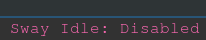

# Sway Idle Toggle

An i3blocklet which toggles locking the screen for the sway window manager.

## Example

```ini
[swayidle_toggle]
label=Sway Idle:
command=$SCRIPT_DIR/swayidle_toggle
color=#FF69B4
full_text="Sway Idle: Active"
interval=0
```



## Notes

If you are setting swayidle in your sway config then you should use `interval=0`
If you have nothing set then you can have `interval=once` and full_text is not 
needed

`command` is just the path to the script.

## Possible updates

Use swaylock config and swayidle config
